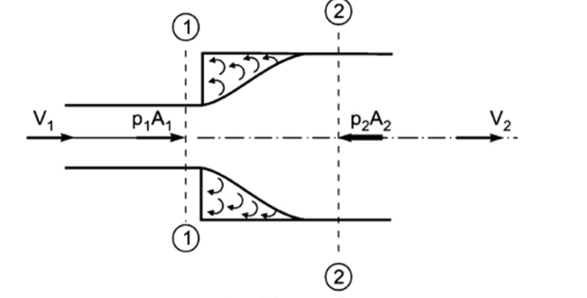
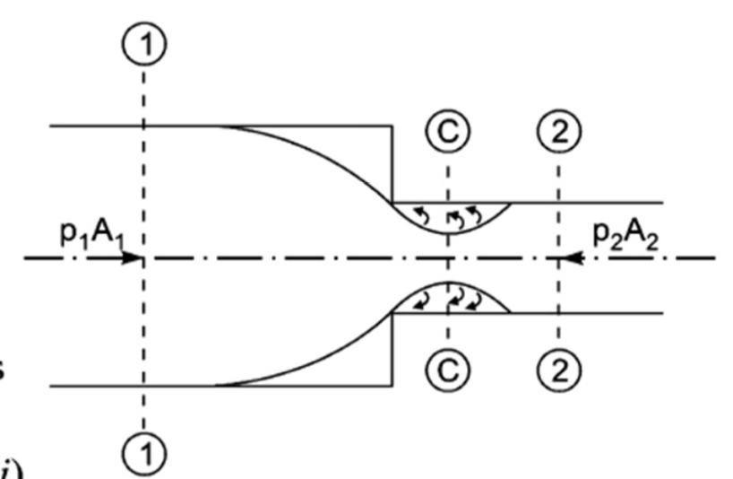

<h2>INTRODUCTION </h2>
We have seen that when the Reynolds number is less than 2000 for pipe flow, the flow is known as laminar flow whereas when the Reynolds number is more than 4000, the flow is known as turbulent flow. In this chapter, the turbulent flow of fluids through pipes running full will be considered. If the pipes are partially full as in the case of sewer lines, the pressure inside the pipe is same and equal to atmospheric pressure. Then the flow of fluid in the pipe is not under pressure. This case will be taken in the chapter of flow of water through open channels. Here we will consider flow of fluids through pipes under pressure only.

<h2>Loss Of Energy In Pipes</h2>

When a fluid is flowing through a pipe, the fluid experiences some resistance due to which some of the energy of fluid is lost. This loss of energy is classified as: 

1. Major Energy Losses: This is due to friction and it is calculated by the following formulae: 
    - Darcy-Weisback Formula
    - Chezy's Formula

2. Minor Energy Lossess: This is due to:
    - Sudden expension of pipe
    - Sudden contraction of pipe
    - Bend in pipe
    - Pipe fitting etc
    - An obstruction in pipe

<h2>LOSS OF ENERGY (OR HEAD) DUE TO FRICTION </h2>

(a) <b>Darcy-Weisbach Formula</b>: The loss of head (or energy) in pipes due to friction is calculated from Darcy-Weisbach equation which has been derived in chapter 10 and is given by

$$ h_f = \frac{4.f.L.V^2}{d \times 2g}  \ \ \ \ \ ...(i)$$

Where 

hf = loss of head due to friction

f = co-efficient of friction which is a function of Reynolds number

$$ = \frac{16}{R_e} \ for \ R_e < 2000 \ (\text{viscous flow}) $$

$$ = \frac{0.079}{R_e^{1/4}} \ \text{varying from 4000 to 1000000} $$

L = length of pipe,  
V = mean velocity of flow  
d = diameter of pipe

 

(b) <b>Chezy's Formula for loss of head due to friction in pipes</b>:

$$ h_f = \frac{f'}{\rho_{g}} \times \frac{P}{A} \times L \times V^2 \ \ \ \ \ ...(ii) $$

where  

hf = loss of head due to friction  
A = area cross-section of pipe  
V = mean velocity of flow  
P = wetted perimeter of pipe  
L = length of pipe  

Now the ratio of A/P is called hydraulic mean depth or hydraulic radius and is denoted by m

$$ \therefore \ m = \frac{A}{P} = \frac{\frac{\pi}{4}d^2}{\pi d} = \frac{d}{4} $$

Substituting A/P  = m or P/A = 1/m in eqaution (i), we get  

$$ h_f = \frac{f'}{\rho g} \times L \times V^2 \times \frac{1}{m} \quad \text{or} \quad V^2 = h_f \times \frac{\rho g}{f'} \times m \times \frac{1}{L} = \frac{\rho g}{f'} \times m \times \frac{h_f}{L} $$

$$ \therefore \ \  V = \sqrt{\frac{\rho g}{f'} \times m \times \frac{h_f}{L}} = \frac{\sqrt{\rho g}}{f'} \sqrt{m\frac{h_f}{L}} \ \ \ \ \ ...(iii) $$

Let  

$$ \sqrt{\frac{\rho g}{f'}} = C $$

where C is constant known as Chezy's constant and 

$$ \frac{h_f}{L} = i $$

Where i is loss of head per unit length of pipe  

$$ \text{Substituting the values of} \ \ \sqrt{\frac{\rho g}{f'}} \ \ and \ \ \sqrt{\frac{h_f}{L}} \\ \text{in equation (iii)} $$

$$ V = C \sqrt{mi} \ \ \ \ \ ...(iv) $$

Equation (iv) is known as Chezy's formula. Thus the loss of head due to friction in pipe from Chezy's formula can be obtained if the velocity of flow through pipe and also the value of C is known. The value of m for pipe is always equal to d/4.  

 

<h2>MINOR ENERGY (HEAD) LOSSES </h2>
The loss of head or energy due to friction in a pipe is known as major loss while the loss of energy due to change of velocity of the following fluid in magnitude or direction is called minor loss of energy. The minor loss of energy (or head) includes the following cases:  

1. Loss of head due to sudden enlargement,
2. Loss of head due to sudden contraction,
3. Loss of head at the entrance of a pipe,
4. Loss of head at the exit of a pipe,
5. Loss of head due to an obstruction in a pipe,
6. Loss of head due to bend in the pipe,
7. Loss of head in various pipe fittings.

 
In case of long pipe the above losses are small as compared with the loss of head due to friction and hence they are called minor losses and even may be neglected without serious error. But in case of a short pipe, these losses are comparable with the loss of head due to friction.  

 

<b>Loss of Head Due to Sudden Enlargement</b>:  Consider a liquid flowing through a pipe which has sudden enlargement as shown in Fig. 1. Consider two sections (1)-(1) and (2)-(2) before and after the enlargement.

$$ Figure\ 1 \ Sudden \ enlargement $$

Let  

P1 = pressure intensity at section 1-1,  
V1 = velocity of flow at section 1-1,  
A1 = area of pipe at section 1-1,  
p2, V2 and A2 = Corresponding values at section 2-2  

Due to sudden change of diameter of the pipe from D, to D2, the liquid flowing from the smaller pipe is not able to follow the abrupt change of the boundary. Thus the flow separates from the boundary and turbulent eddies are formed as shown in Fig. 1. The loss of head (or energy) takes place due to the formation of these eddies.  

Let  
p' = pressure intensity of the liquid eddies on the area (A2 – A1)  
he = loss of head due to sudden enlargement  

Applying Bernoulli's equation at sections 1-1 and 2-2,

$$ \frac{p_1}{\rho g} + \frac{V_1^2}{2g} + z_1 = \frac{p_2}{\rho g} + \frac{V_2^2}{2g} + z_2 + \ \text{loss of head due to sudden enlargment}$$

But  

$$ \therefore \ \frac{p_1}{\rho g} + \frac{V_1^2}{2g} = \frac{p_2}{\rho g} + \frac{V_2^2}{2g} + h_e $$

Or  

$$ h_e = \left( \frac{p_1}{\rho g} - \frac{p_2}{\rho g} \right) + \left( 
     \frac{V_1^2}{2g} - \frac{V_1^2}{2g}
 \right) $$

Consider the control volume of liquid between sections 1-1 and 2-2. Then the force acting on the liquid in the control volume in the direction of flow is given by

$$ F_x = p_1A_1 + p'(A_2 - A_1) - p_2A_2 = p_1A_2 - p_2A_2 $$

$$ = (p_1 - p_2)A_2 $$

Momentum of liquid/sec at section 1-1 = mass x velocity  

$$  = \rho A_1 V_1 \times V_1 = \rho A_1 V_1^2 $$

Momentum of liquid/sec at section 2-2  

$$ = \rho A_2 V_2^2 \times V_2 = \rho A_2 V_2^2 $$

$$ \text{Change of momentum/sec} = \rho A_2 V_2^2 - \rho A_1V_1^2 $$

But from continuity equation, we have

$$ A_1 V_1 = A_2 V_2 or A_1 = \frac{A_2V_2}{V_1} $$

$$ \text{Change of momentum/sec} = \rho A_2 V_2^2 - \rho \times \frac{A_2 V_2}{V_1} \times V_1^2 = \rho A_2 V_2^2 - \rho A_2 V_1 V_2 $$

$$ \rho A_2 [V_2^2 - V_1V_2] $$

Now net force acting on the control volume in the direction of flow must be equal to the rate of change of momentum or change of momentum per second. Hence equating above equations

$$ (p_1 - p_2)A_2 = \rho A_2 [V_2^2 - V_1V_2] $$

Or  

$$ \frac{p_1 - p_2}{\rho} = V_2^2 - V_1V_2 $$

Dividing by g on both sides, we have  

$$ \frac{p-1 - p_2}{\rho g} = \frac{V_2^2 - V_1V_2}{g} $$

Or  

$$ \frac{p_1}{\rho g} - \frac{p_2}{\rho g} = \frac{V_2^2 - V_1V_2}{g} $$

$$ \text{Substituting the value of} \ of \left( \frac{p_1}{\rho g} - \frac{p_2}{\rho g} \right) \ \text{in equation above we get} $$

$$ h_e = \frac{V_2^2 - V_1V_2}{g} + \frac{V_1^2}{2g} - \frac{V_2^2}{2g} = \frac{2V_2^2 - 2V_1V_2 + V_1^2 - V_2^2}{2g} $$

$$ h_e = \frac{(V_1^2 - V_2^2)}{2g} $$

 Loss of Head due to Sudden Contraction</b>: Consider a liquid flowing in a pipe which has a sudden contraction in area as shown in Fig. 2. Consider two sections 1-1 and 2-2 before and after contraction. As the liquid flows from large pipe to smaller pipe, the area of flow goes on decreasing and becomes minimum at a section C-C as shown in Fig. 2. This section C-C is called Vena-contracta. After section C-C, a sudden enlargement of the area takes place. The loss of head due to sudden contraction is actually due to sudden enlargement from Vena-contracta to smaller pipe.  

$$ Figure\ 1 \ Sudden \ contraction $$

Let  
Ac = Area of flow at section C-C  
Vc = Velocity of flow at section C-C  
A2/sub> = Area of flow at section 2-2  
V2 = Velocity of flow at section 2-2  
h2 = Loss of head due to sudden contraction.  

 

Now he actual loss of head due to enlargement from
section C-C to section 2-2 and is given by equation above as

$$ \frac{(V_c - V_2)^2}{2g} = \frac{V_2^2}{2g}\left[\frac{V_c}{V_2} - 1 \right]^2 $$

From continuity equation, we have  

$$ A_cV_c = A_2V_2 \ or \ \frac{V_c}{V_2} = \frac{A_2}{A_c} = \frac{1}{A_c/A_2}  = \frac{1}{C_c}$$

Susbstituting the value of Vc / V2 in equation above, we get

$$ h_c = \frac{V_2^2}{2g}\left[ \frac{1}{C_c} - 1 \right]^2 $$

$$ \frac{kV_2^2}{2g}, \ where \ k = \left[ 0.375 \frac{V_2^2}{2g} \right] $$

If the value of Cc is assumed to be equal to 0.62, then  

$$ \text{then} \ h_c \ \text{becomes as } h_c = \frac{kV_2^2}{2g} \ \ or \\ h_c = 0.375\frac{V_2^2}{2g} $$

 
<b>Loss of Head at the Entrance of a Pipe</b>:  This is the loss of energy which occurs when a liquid enters a pipe which is connected to a large tank or reservoir. This loss is similar to the loss of head due to sudden contraction. This loss depends on the form of entrance. For a sharp edge entrance, this loss is slightly more than a rounded or bell mouthed entrance.  

In practice the value of loss of head at the entrance (or inlet) of a pipe with sharp cornered entrance is taken  

$$ = 0.5\frac{V^2}{2g} \ \text{where 2g V = velocity of liquid in pipe.} $$

$$ \text{This loss is denoted by} \ h_i $$

$$ h_i = 0.5\frac{V^2}{2g} $$

 

<b>Loss of Head at the Exit of Pipe</b>: This is the loss of head (or energy) due to the velocity of liquid at outlet of the pipe which is dissipated either in the form of a free jet (if outlet of the
pipe is free) or it is lost in the tank or reservoir (if the outlet of the pipe is connected to the tank or v2 reservoir).  

This loss is equal to  

$$ = \frac{V^2}{2g} $$

where Vis the velocity of liquid at the outlet of pipe. This loss is denoted h0

$$
h_0 = \frac{V^2}{2g}
$$
 

<b>Loss of Head due to Bend in Pipe<b>: When there is any bend in a pipe, the velocity of flow changes, due to which the separation of the flow from the boundary and also formation of eddies takes place. Thus the energy is lost. Loss of head in pipe due to bend is expressed as

$$ h_b = \frac{kV^2}{2g}$$

Where  
hb = loss of head due to bend,  
V = velocity of flow,  
k = co-efficient of bend  

The value of k depends upon    (1) Angle of bend,   (2) Radius of curvature,   (3) Diameter of pipe

 

<b>Loss of Head in Various Pipe Fittings</b>: The loss of head in the various pipe fittings such as valves, couplings etc., is expressed as 

$$ = \frac{kV^2}{2g} $$

where 
V = velocity of flow,  
k = co-efficient of pipe fitting  

